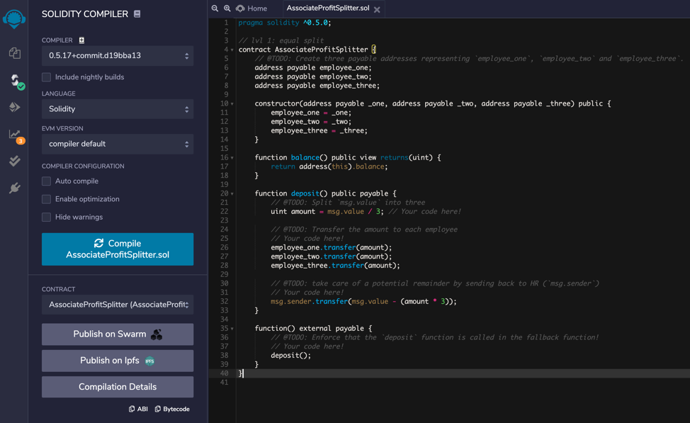
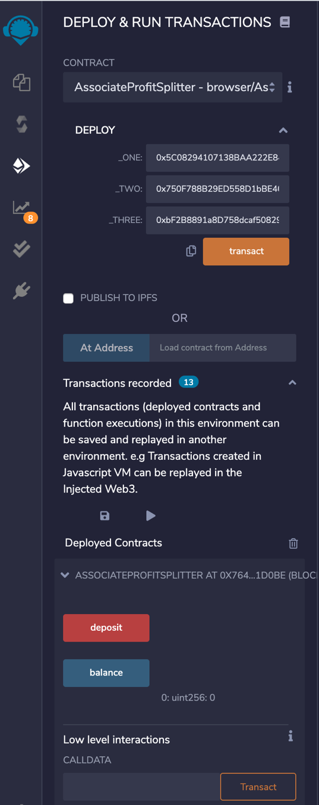
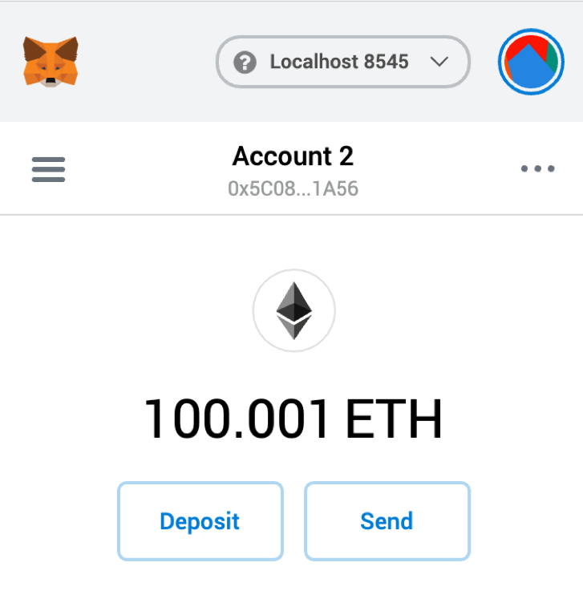
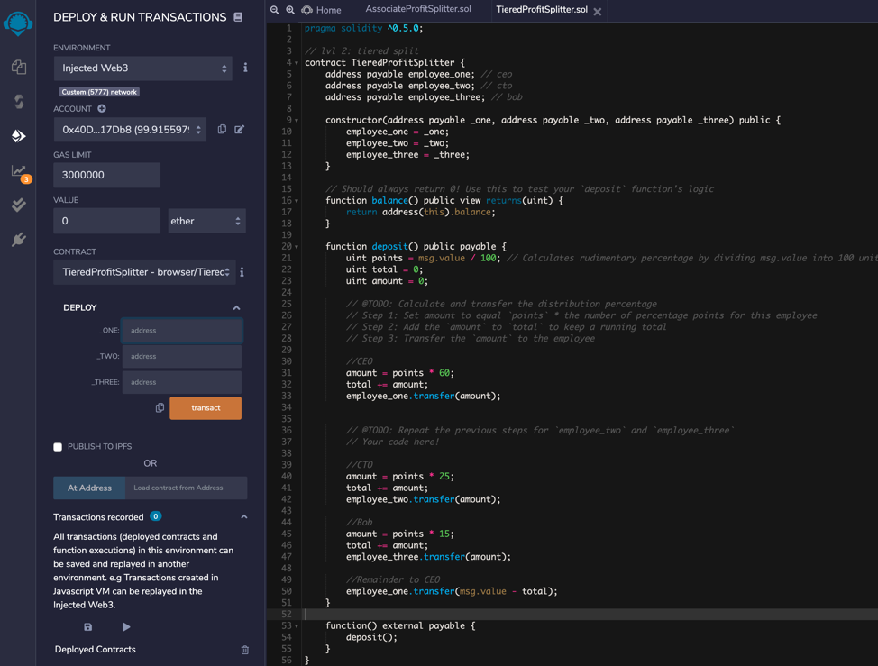
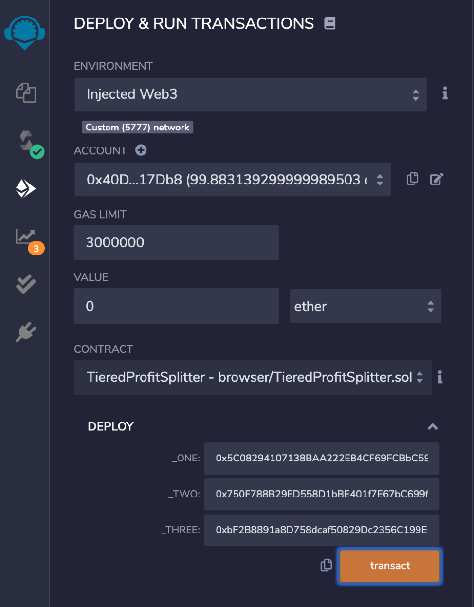
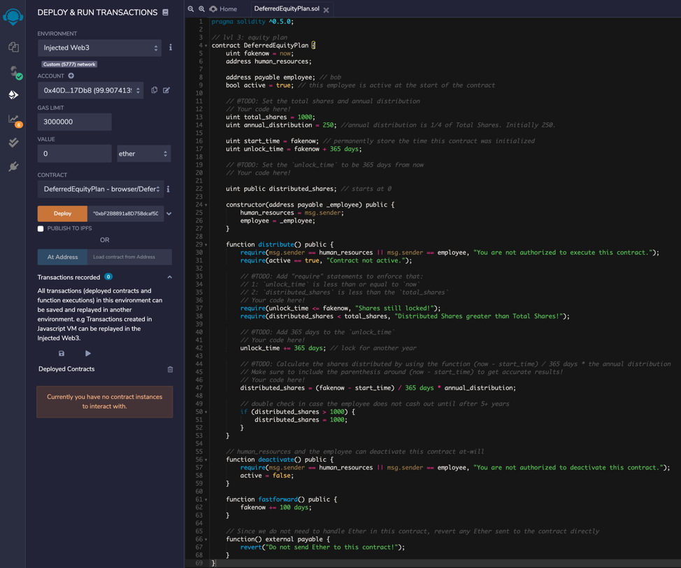

# Unit 20 - Solidity Contracts

## Contracts Developed and Deployed

The following contracts has been developed for this assignment in [Remix](https://remix.ethereum.org/#optimize=false&evmVersion=null&version=soljson-v0.5.17+commit.d19bba13.js). In the following links you can find the solidity code for each contract:

1. [`AssociateProfitSplitter.sol`](Starter-Code/AssociateProfitSplitter.sol)

   
   
   To be deployed with the following parameters:
                         
       HR Address: 0x40De7759EF972F8DB32D0cf55b589d37ec817Db8

       Employee1 Address: 0x5C08294107138BAA222E84CF69FCBbC599081A56

       Employee2 Address: 0x750F788B29ED558D1bBE401f7E67bC699fbe79E7

       Employee3 Address: 0xbF2B8891a8D758dcaf50829Dc2356C199E0f3051

   

       Contract: 0xF8ef6A11d76dB9e0AaE21146592565E239F9445f
       
       After testing the contract with some values, you can check the balance of each address in MetaMask to validate the values:

   

   

   
      
2. [`TieredProfitSplitter.sol`](Starter-Code/TieredProfitSplitter.sol)
   
   
   
   To be deployed with the following parameters:
                         
       HR Address: 0x40De7759EF972F8DB32D0cf55b589d37ec817Db8
       
       CEO Address: 0x5C08294107138BAA222E84CF69FCBbC599081A56
       
       CTO Address: 0x750F788B29ED558D1bBE401f7E67bC699fbe79E7
       
       Bob Address: 0xbF2B8891a8D758dcaf50829Dc2356C199E0f3051

   

       Contract: 0x7768f0270C5f645020640f90c901EBD7E07f455a
       
       After testing the contract with some values, you can check the balance of each address in MetaMask to validate the values:

   

   

   
   
3. [`DeferredEquityPlan.sol`](Starter-Code/DeferredEquityPlan.sol)

   
   To be deployed with the following parameters:
                         
       HR Address: 0x40De7759EF972F8DB32D0cf55b589d37ec817Db8
       
       Bob Address: 0xbF2B8891a8D758dcaf50829Dc2356C199E0f3051
       
       
